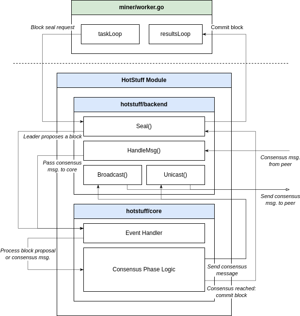
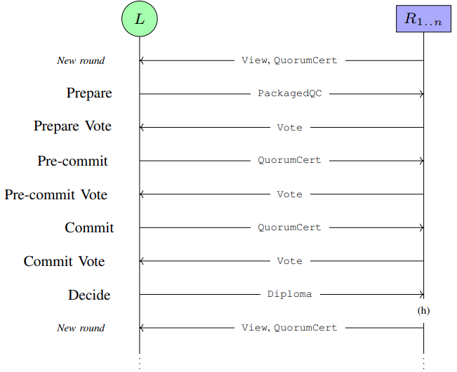

# BHS Implementation

## Consensus Module (`/consensus`)

We implement BHS using the same framework as IBFT and QBFT:



Like IBFT and QBFT, BHS is implemented as its own consensus module in `/consensus`. The diagram above shows that leaders begin consensus upon receiving a *block seal request* from the miner. Seal requests are handled by the BHS consensus module, which passes a proposed block to the core.

## BHS Module (`/consensus/hotstuff`)



The BHS consensus module is located in `/consensus/hotstuff`. Our implementation is heavily influenced by PolyNetwork's ongoing [Zion](https://github.com/polynetwork/Zion) project -- a Geth fork with a BHS implementation. We base BHS off of an [earlier commit](https://github.com/polynetwork/Zion/commits/afd46539f2effc8532ac2a46f4b44107e39e654b), pruning only the BHS-relevant parts. Zion, albeit our foundation for implementing BHS, lacks several key features for an accurate BHS performance evaluation:

- Uses $n$ ECDSA signatures for Quorum certificates instead of aggregated threshold signature
- No block time parameter

We give an overview of our implementation below. Please read the [BHS specfications](https://arxiv.org/pdf/1803.05069.pdf) for more information.

### Consensus Messages

As with Zion, IBFT, and QBFT, we separate consensus logic (`/hotstuff/core`) from backend logic (`/hotstuff/backend`). `core` handles all actions affecting the local consensus state. `backend` handles miner requests and consensus message sending/receiving. Consensus messages are processed by the `core`, changing the local state. Messages are represented as `Message` objects that store a byte-encoded payload in its `Message.Msg` field.

Payloads in the `Message.Msg` field can be one of the ff objects (see `consensus/hotstuff/types.go`):

#### `View`

```golang
type View struct {
	Round  *big.Int
	Height *big.Int
}
```

- Contains the view number and view round
- View round is the number of unsuccessful consensus attempts per view number

#### `ProposedBlock`
```golang
type ProposedBlock struct {
	hash common.Hash

	Parent common.Hash  // Parent ProposedBlock hash
	Block  *types.Block // Command to agree on
}
```

- Wraps proposed block (`ProposedBlock.Block`) as a command list node (linked-list node)
- Has its own hash and parent `ProposedBlock` hash -- both of which are separate from the block hash

#### `Vote`
```golang
type Vote struct {
	Code          MsgType
	View          *View
	ProposedBlock common.Hash // Hash of Proposal/Block

	BLSSignature []byte
}
```

- Represents replica votes
- Vote information is represented by the ff fields:
  - `Code`
  - `View`
  - `ProposedBlock`
- Vote information is signed by partial signature `Vote.BLSSignature`
- Accepted votes in a phase must all contain the same vote information

#### `QuorumCert`
```golang
type QuorumCert struct {
	View          *View
	Code          MsgType
	ProposedBlock common.Hash // ProposedBlock hash NOT Block hash
	Proposer      common.Address
	BLSSignature  []byte
}
```

- Represents quorum certificates
- Contains vote information fields and aggregated signature
- Contains the same vote information all accepted votes


#### `PackagedQC`

```golang
type PackagedQC struct {
	ProposedBlock *ProposedBlock
	QC            *QuorumCert // QuorumCert only contains Proposal's hash
}
```

- Sent during the Prepare phase
- Carries both the proposed block and HighQC

#### `Diploma`

```golang
type Diploma struct {
	CommitQC  *QuorumCert
	BlockHash common.Hash
}
```
- Sent during the Decide phase
- Carries both the proposed block's block hash and the CommitQC


### Threshold Signing

We use the [`kyber/v3` library](https://github.com/dedis/kyber) created by the DEDIS lab at EPFL for implementing BLS threshold signing. Threshold signing methods are found in the `/consensus/hotstuff/signer` submodule. `signer` supports the ff BLS operations:

1. `BLSSign()`: generates partial signature over passed bytes 220$\mu$s
2. `BLSRecoverAggSig()`: creates aggregated BLS signature from partial signatures 32000$\mu$s
3. `BLSVerifyAggSig()`: verifies data using the aggregate signature 2900$\mu$s

The table below are benchmark results given $(t, n)=(11, 16)$ and 16 signers on a Ryzen 5 2600X w/ 16 GB RAM:

|     BLS Operation     | Exec. Time ($\mu$s) |
|:---------------------:|:-------------------:|
|      `BLSSign()`      |         220         |
|  `BLSRecoverAggSig()` |        32000        |
| ` BLSVerifyAggSig()`  |         2900        |

`BLSRecoverAggSig()` is the slowest operation at scale because it validates every partial signature before aggregation.

Zion imitates BHS's signature scheme requirements by using ECDSA signatures. However, the $(t,n)$-threshold scheme bears a majority of BHS's crypographic computational overhead. This is is an inaccurate substitute if we wish to measure BHS's perfomance.

## Testing

### Mock Network Tests `hotstuff/mock`

Refer to the [mock testing documentation](./hotstuff/mock/README.md).

### Faulty Node Tests `hotstuff/faulty`

Some byzantine behaviors we intend to test cannot be replicated by the mock network. Instead, we run live networks and configure some validators to run specific byzantine behaviors. These validators are referred to as *faulty nodes*. To avoid performance overheads, we replace the `hotstuff/core` consensus logic -- which is used in performance tests -- with `hotstuff/faulty`.

Configure the `hotstuff.faultymode` genesis setting to run one of the ff behaviors:

- `TargetedBadPreCommit`
	- Leader sends a faulty PreCommit message to < $f$ replicas (at Height: 4)
	- No round change should occur
- `TargetedBadCommit`
	- Leader sends a faulty Commit message to < $f$ replicas (at Height: 4)
	- No round change should occur
- `BadDecideBadBlock`
	- Leader uses a faulty CommitQC for both the Decide message and block sealing (at Height: 4)
	- Round change should occur

A sample genesis snippet (N=4) can be found below:

```json
  "config": {
    "hotstuff": {
        "blockperiodseconds": 1,
        "faultymode": "TargetedBadPreCommit",
        "policy": "RoundRobin",
        "requesttimeoutmilliseconds": 5000,
        "validators": [
            "0xb885880243555303568e9dea9d7c21daed6cf90c",
            "0x4182e9f69f8378a84e8adcfd3943c1f3c6d64d00",
            "0x19aec4f7908b4505d32b1722774ff392d295363e",
            "0xaa2d9624df05a6fbc73f1cd6a76a4a63d23da3ef",
        ]
    },
  }
```

To run these tests, configure the `samples/simple` genesis file (`config/goquorum/data/genesis.json`) accordingly.

